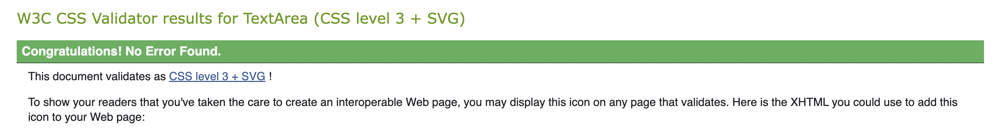
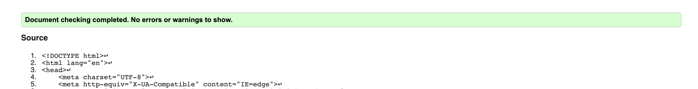
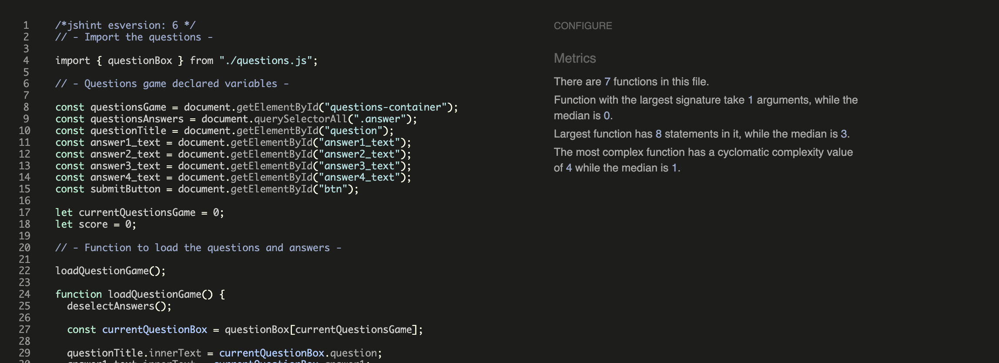
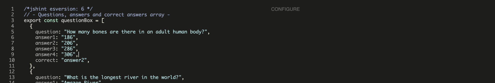
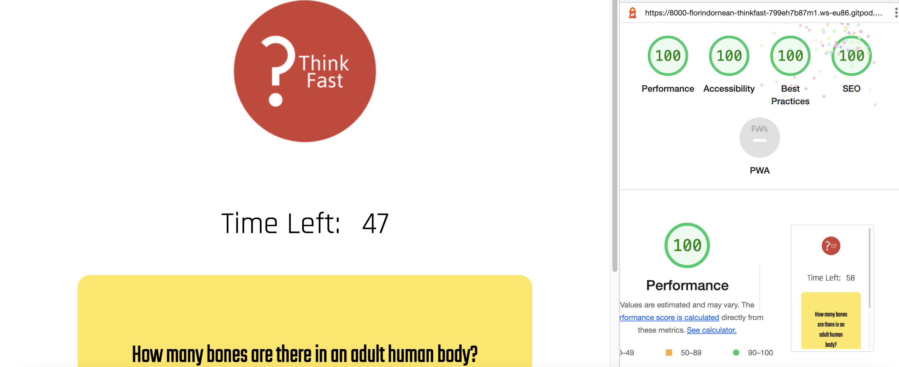
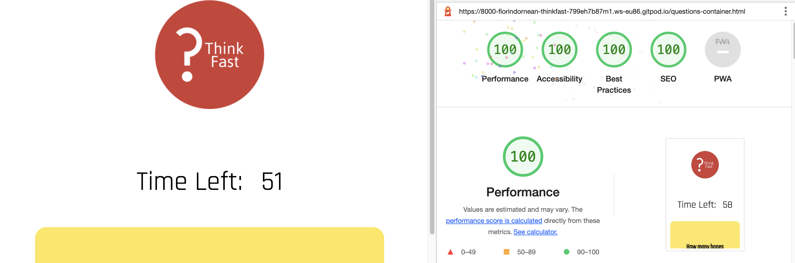

# Think Fast
## Milestone Project Two

Think Fast is a general questions quiz game. The quiz has ten questions that the user has to answer in 60 seconds. If the time is over, the game finishes. The user has to press Start button to enter the questions. After one question is answered, the user has to press the submit button to get to the next question. When all the questions are answered and the user presses the Submit button, the results will be shown to the user. The user can reload the quiz or quit it. The user is presented with the rules of the quiz in the beginning of the game, when pressing the button Game Rules.
The quiz has simple and diverse questions so is suitable for all users ages.  
***

## Demo 

The live website can be viewed  here - [Think Fast](https://florindorneanu.github.io/think.fast/)

The GitHub repository can be viewed here - [FlorinDorneanu/think.fast](https://github.com/FlorinDorneanu/think.fast)


***
## User Experience (UX)

### Strategy

### User Stories
As a user I want to be able to :
* Understand what the quiz is about.
* Be able to know the rules of the game.
* Easily enter the quiz.
* Quit the quiz with ease.
* See how much time I have left to answer the questions.
* Easily select the options provided.
* To submit the answer with ease.
* Get the final score at the end of the quiz.
* Replay the quiz.

## Structure

The quiz game will have :
* A homepage containing the logo, an inviting message, a button to start the game and a button for the rules of the quiz.
* A Game Rules screen which will contain the rules of the game and a button to start the quiz.
* The quiz game that will consists of a timer, question, for options and a "Submit" button.
* A Result screen containing the score of the user, a "Replay" button and a "Quit" button.

## Skeleton
* Desktop Wireframes - [Homepage](images-for-readme/think.fast-wireframe-homepage-desktop.png)/[Rules](images-for-readme/game-rules-desktop.png)/[Quiz](images-for-readme/quiz-game-desktop.png)/[Score](images-for-readme/score-desktop.png)


* Mobile Wireframes - [Homepage](images-for-readme/think.fast-wireframes-homepage-mobile.png)/[Rules](images-for-readme/game-rules-mobile.png)/[Quiz](images-for-readme/quiz-game-mobile.png)/[Score](images-for-readme/score-mobile.png)

## Surface

### Colour
A shade of red and a shade of yellow were used primarily on the website. The colours were chosen for their playful vibe and the nice contrast. Black and white, being strong in contrast colours, were used for typography because they work great with the primary colours.

### Typography
The chosen fonts are "Rajdhan" and "Teko". The "Teko" font was used for the heading and the "Rajdhan" was used for the answers. The fonts have been taken from [Google Fonts](https://fonts.google.com/).

### Call to Action
* The "Start" button takes the user to the questions of the quiz game.
* The "Game Rules" button opens the rules of the game. From there the user can click on the button "Start" that takes the user to the questions of the quiz.
* The "Submit" button takes the user to the next question.
* At the end of the questions, when the user presses on the "Submit" button, the user will be presented with the score achieved.
* At the end of the game, the user can choose to press the "Reload" button for another play of the quiz.

### Features to Implement in future
* A highscore board;
* A list of 100 questions from where only 10 questions will be randomly selected.
* To use random storage for registering the question game and highscore.
* The incorrect and correct answer to have different colours.
***

# Technologies Used
* HTML5 - Mark-up language using semantic structure.
* CSS3 - Cascading style sheet used for styling.
* Gitpod.io - For writing the code, using the command line for commiting and pushing to GitHub.
* GitHub - Used to host the repository.
* Git - Used for version control of the project.

### Design
* [Google fonts](https://fonts.google.com/) - For styling the typography.
* [Balsamiq wireframe](https://balsamiq.cloud/) - To build wireframes in the design phase.
* [Beautifier](https://beautifier.io) - To beautify HTML and CSS code.
* [Prettier](https://prettier.io/) - To beautify Javascript code.
* [Logo](https://logo.com) - To make the logo of the website.

### Testing
* [JsHint](https://jshint.com) - Testing validity of JavaScript.
* [HTML Validator](https://validator.w3.org/#validate_by_input) - Testing validity of HTML.
* [CSS Validator](https://jigsaw.w3.org/css-validator/) - Testing validity of CSS.
* [Am I Responsive](https://ui.dev/amiresponsive#) - Checking the responsive nature and creating the mock-ups provided.
* DEV Tools - Lighthouse.
***

## Testing

### Validator Testing

* HTML Validator



* CSS Validator

* Javascript Validator for script.js file

* Javascript Validator for questions.js file


### Performance Testing

Tested using the Developer Tools Lighthouse for desktop and mobile :

### Desktop


### Mobile


## Testing - Table of Contents

| Test Description  | Expected Outcome  | Actual Outcome  |  Re-Test |
|---|---|---|---|
| Test the Start button  | When the button is clicked the quiz game should appear  | Passed  | Passed  |
| Test the Game Rules button  | The button should open the rules of the game  | Passed  | Passed  |
| Test the Start button on the Game Rules screen  | The button should send the user to the quiz game  | Passed  | Passed  |
| Test the Submit button  | The button should send the user to the next question and when the questions are completed, the button should present the score to the user  | Passed  | Passed  |
| Test the Reload button  | When the button is clicked the quiz game should reload  | Passed  | Passed  |
| Test the Quit button  | The button should quit the game and open the homepage  | Passed  | Passed  |
| Test the timer  | The timer should go from 60 seconds to 0 seconds, if time has passed and the questions are not completely answered, then the game finishes  | Passed  | Passed  |

### Browser Compatibility

The website was tested on the following browsers:
* Google Chrome, desktop and mobile;
* Safari, desktop and mobile;
* Mozila Firefox, desktop and mobile.

### OS Compatibility

Tested on iOS, macOS and Android. 
Chrome Developer Tools was used for testing the responsiveness.
***

## Deployment

### Delpoying to GitHub Pages

The project was deployed with the following steps

* Log into GitHub;
* Click the "Settings" button in the menu above the Repository;
* Scroll down the Settings page to the "GitHub Pages" Section;
* Under "Source", click the dropdown called "None" and then select "Master Branch";
* The page will automatically refresh, and a link displaced. It may take some time for the link to show the website.
* If the page will not load go down to "template" under the "source" and select a template.
* Scroll back down through the page to locate the now published site link in the "GitHub Pages" section.


### Forking

Forking the GitHub Repository

By forking the GitHub Repository, you can make a copy of the original repository in your own GitHub account. This means we can view or make changes without making the changes affecting the original.

* Log into GitHub and locate the GitHub Repository;
* At the top of the Repository there is a "Fork" button about the "Settings" button on the menu;
* You should now have a new copy of the original repository in your own GitHub account.

### Cloning
 
 Taken from GitHub's documentation on cloning, which can be found [here](https://docs.github.com/en/repositories/creating-and-managing-repositories/cloning-a-repository#cloning-a-repository-to-github-desktop) :
 
* Once logged into GitHub, navigate to the repository you wish to clone.
* Next to the green Gitpod button there's a button that reads code, click this.
* To clone the repository using HTTPS, copy the link whilst HTTPS is selected.
* Open your local IDE of choice and open the terminal.
* Navigate to the working directory of where you want the cloned directory to be.
* Type ```git clone``` in the terminal and then paste the link that you selected in step 3. Press enter.
* The clone is created in your current working directory (```cwd```).

### Adding and commiting files

I’ve been using Gitpod to write my code and using the terminal within to add, commit and push code from my workspace to GitHub where it is stored remotely as shown in the course content.

* When I have made a couple of minor additions / changes or one large change or addition I add the file in question to the staging area by typing in the terminal git add . the full stop will add all new files.
* I now want to save my changes to the local repository by typing git commit –m “ ” into the terminal. Between the “ ” I'll write a concise message detailing what this commit has done.
* When I either want to upload all my changes for the day or view on GitHub Pages I push all the commits I’ve previously done to GitHub using the git push command. When GitHub Pages is set up for the repository in question it will automatically pick up these changes and display the most up to date version that has been pushed.
***

## Debugging
* Function loadQuestionGame didn't load the questions. Fixed by setting a variable currentQuestionGame with the value of 0 and assigned it to currentQuestionBox.
* Function getSelected didn't work. Fixed by creating a deselectAnswers function.
* When countdown got to 0, the timer didn't display the correct answer. Fixed by adding else statement where I've added innerHtml to questionsGame.

## Credits

### Acknowledgements
* Tutor support at Code Institute for their help.
* [Code Institute SampleREADME](https://github.com/Code-Institute-Solutions/SampleREADME)
* [W3schools](https://www.w3schools.com) - for various code information.
* [Balsamiq wireframes](https://balsamiq.cloud/) - To build wireframes in the design phase.
* [Font Awesome](https://fontawesome.com/) - For the icon presented next to the title, the icons used for the correct and incorrect answer and for the favicon.
* [Beautifier](https://beautifier.io) - To beautify my code.
* [Prettier](https://prettier.io/) - To beautify Javascript code.
* [JsHint](https://jshint.com) - Testing validity of JavaScript.
* [Online-Convert](https://image.online-convert.com/convert-to-webp) - To convert my images to WebP.
* [HTML Validator](https://validator.w3.org) - Testing validity of HTML.
* [CSS Validator](https://jigsaw.w3.org/css-validator/) - Testing validity of CSS.
* [Am I Responsive](https://ui.dev/amiresponsive#) - Checking the responsive nature and creating the mock-ups provided.

## Code
* Code on how to select answers came from this website [Useful language](https://usefulangle.com/post/254/javascript-loop-through-select-options).
* Code on how to submit answers came from this website [Stackoverflow](https://stackoverflow.com/questions/60476845/addeventlistener-and-if-statement-on-button-clicked).
* Code on how to set timer came from this website [Educative](https://www.educative.io/answers/how-to-set-a-timer-in-javascript).

## Content
Questions and answers for the quiz game were taken from this website [Kwizzbit](https://kwizzbit.com/50-general-knowledge-quiz-questions-and-answers/).

