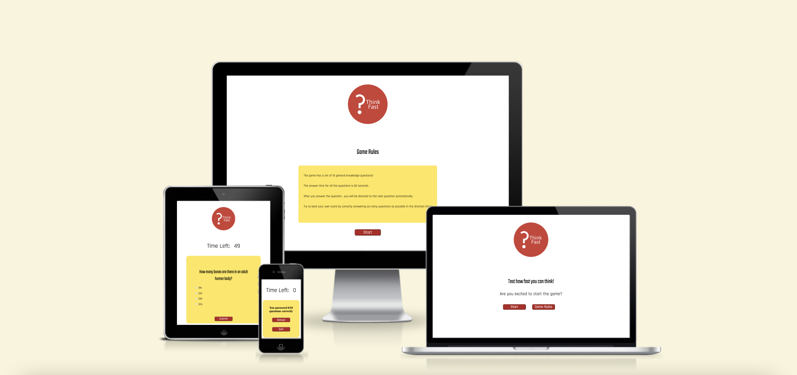

# Think Fast
## Milestone Project Two

Think Fast is a general questions quiz game. The quiz has ten questions that the user has to answer in 60 seconds. If the time is over, the game finishes. The user has to press Start button to enter the questions. After one question is answered, the user has to press the submit button to get to the next question. When all the questions are answered and the user presses the Submit button, the results will be shown to the user. The user can reload the quiz or quit it. The user is presented with the rules of the quiz in the beginning of the game, when pressing the button Game Rules.
The quiz has simple and diverse questions so is suitable for all users ages.  
***

## Demo 

The live website can be viewed  here - [Think Fast](https://florindorneanu.github.io/think.fast/)

The GitHub repository can be viewed here - [FlorinDorneanu/think.fast](https://github.com/FlorinDorneanu/think.fast)

***
## User Experience (UX)

### Strategy

### User Stories
As a user I want to be able to :
* Understand what the quiz is about.
* Be able to know the rules of the game.
* Easily enter the quiz.
* Quit the quiz with ease.
* See how much time I have left to answer the questions.
* Easily select the options provided.
* To submit the answer with ease.
* Get the final score at the end of the quiz.
* Replay the quiz.

## Structure

The quiz game will have :
* A homepage containing the logo, an inviting message, a button to start the game and a button for the rules of the quiz.
* A Game Rules screen which will contain the rules of the game and a button to start the quiz.
* The quiz game that will consists of a timer, question, for options and a "Submit" button.
* A Result screen containing the score of the user, a "Replay" button and a "Quit" button.

## Skeleton
* Desktop Wireframes - [Homepage](images-for-readme/think.fast-wireframe-homepage-desktop.png)/[Rules](images-for-readme/game-rules-desktop.png)/[Quiz](images-for-readme/quiz-game-desktop.png)/[Score](images-for-readme/score-desktop.png)

* Mobile Wireframes - [Homepage](images-for-readme/think.fast-wireframes-homepage-mobile.png)/[Rules](images-for-readme/game-rules-mobile.png)/[Quiz](images-for-readme/quiz-game-mobile.png)/[Score](images-for-readme/score-mobile.png)